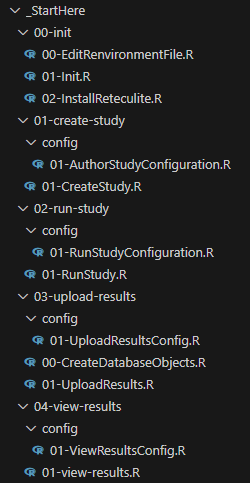

Executing Study Steps
=================
## Introduction

This guide gives a quick start guide to executing all of the steps of a study. 
These steps include the following:
<ul>
	<li>
		Initializing the R Environment
	</li>
	<li>
		Createing the Study Definition
	</li>
	<li>
		Running the Study
	</li>
	<li>
		Uploading the Results
	</li>
	<li>
		Viewing the Study Results
	</li>
</ul>

Everything needed to complete all of these steps can be found in the _StartHere folder. 
The structure of the _StartHere folder is shown below.  
 

  

The initialization scripts are a special case.  These scripts are run once to configure and initialize your R environment. Each of these scripts must be run before executing any of the other steps. 

Each of the other steps is defined in two files, a configuration file and an implementation file that is used to exeute the step. For example, the files used to create a study are found in 01-create-study. This folder contains a configuration file (01-create-study/config/01-AuthorStudyConfiguration.R) and an implementation file (01-create-study/01-CreateStudy.R). In most cases the configuration file is the only file that will need to be edited to implement your study. 

It should be noted that in many cases a user will run one or a subset of the steps below. For example, data providers will not run the Create Study step. Note that in all cases the initialization step must be executed before running any other step. 

## Notes on Strategus, HADES, and HADES Modules
This template executes Strategus code.  More information on Strategus is available at https://ohdsi.github.io/Strategus/index.html.  Strategus builds and executes a number of HADES Modules and other packages. More information on HADES is available at https://ohdsi.github.io/Hades/.  The HADES modules all have their own documentation that details what each module does, the input and output of the module, the meanings of each of the variables used by the module, etc.  A list of the available modules and links to the documentation is available at https://ohdsi.github.io/Strategus/reference/index.html#omop-cdm-hades-modules.

## 00 - Initialization: Run the Setup Scripts
<b>Note: this step must be run before any of the other steps shown below. This step only needs to be run once. </b>
 

<b>Important: Open R as Admin.</b> The following process will require the installation of many R packages.  Some of these installs will fail if you do not run as Admin.  
These scripts run renv::restore() and all of the other initialization steps described in the <a href="https://github.com/ohdsi-studies/StrategusStudyRepoTemplate/blob/main/template_docs/UsingThisTemplate.md">Using this Template</a> document. 

To run these scripts, start RStudio as Admin. Select File->Open Project and navigate to the StrategusStudyRepoTemplate.proj file in the StrategusStudyRepoTemplate project. Then run the scripts in the \_StartHere/init folder in order:
<ul>
	<li>
		<b>00-EditRenvironmentFile.R:</b> This script will let you edit your Renviron file.  
		 
		For this step, you will need a Github Personal Access Token (PAT). 
		Use <a href="https://github.com/settings/tokens">https://github.com/settings/tokens</a> to generate your token (you will need to be logged into Github first for this to work).   
		Add the following lines to the .Renviron file
		  
		_JAVA_OPTIONS='-Xmx4g' 
    VROOM_THREADS=1 
		DATABASECONNECTOR_JAR_FOLDER = "C:\Program Files\Stragegus\jdbc\drivers" 
		CDM_DB_PASSWORD = "NA/Eunomia is being used for this example" 
		RESULTS_DB_PASSWORD = "resultsDbPassword" 
		GITHUB_PAT='MY_GITHUB_PAT' 
		 
		These variables represent the following:
		<ul>
			<li>
				<b>_JAVA_OPTIONS</b>
				 
				This is a memory setting for Java that needs to be set to ensure enough memory for underlying Java processes to execute.
			</li>
			<li>
				<b>VROOM_THREADS</b>
				 
				This sets the number of threads used by Strategus.
			</li>
			<li>
				<b>DATABASECONNECTOR_JAR_FOLDER</b>
				 
				This is the folder that R will use to store database driver files. This can be any empty directory. The processes used here use the default drivers. These drivers are automatically downloaded by R when they are needed. 
			</li>
			<li>
				<b>CDM_DB_PASSWORD</b>
				 
				This is the password for the CDM database you are using to run the study. It is not needed for the default case presented here as the Eunomia database is being used. 
			</li>
			<li>
				<b>RESULTS_DB_PASSWORD</b>
				 
				This is the password for the PostgreSql database used to store the study results. 
			</li>
			<li>
				<b>GITHUB_PAT</b>
				 
				This is your Github Personal Access Token (PAT)
			</li>
		</ul>
		 
		After editing and saving this file, restart R (Session->Restart R). You can close the .REnviron file once this step has been completed.   
		 
		<b>Important: Don't forget to save the file before restarting R.</b> 
		<b>Important: Don't forget to restart R.</b> 
		<b>Important: Don't use production passwords in source code.</b> System variables are used here for all passwords to prevent passwords from being leaked when projects are commited to version control or otherwise shared or published. 
		 
	</li>
	<li>
		<b>01-Init.R:</b> This script will run renv::restore(). The renv::restore() call sets your R environment to a spcific configuration that uses a specific set of pacakges and versions of each of those packages.  It is a tool used to create somewhat of a frozen code release of the software we are creating and using here.  
	</li>
	<li>
		<b>02-install-reteculite.R:</b> This script installs the Python environment that will be used by R. 
	</li>
</ul>

## 01 - Create the Study Definition
<b>Important: Before executing this step, run the Initialization scripts if you have not already.</b>
  
This step will download the cohorts for this study and create the analysis specification. 
 
For more details see the <a href="../UsingThisTemplate.md">Using This Template</a> document.  
 
To create a study:
<ul>
	<li>
		Edit ./_StarteHere/01-create-study/config/01-AuthorStudyConfiguration.R. 
	</li>
	<li>
		Execute ./_StarteHere/01-create-study/01-CreateStudy.R.
	</li>
</ul>

## 02 - Run the Study 
<b>Important: Before executing this step, run the Initialization scripts if you have not already.</b>
  
This step will run the study using the database (CDM) specified in the configuration file. 
 
For more details see the <a href="../UsingThisTemplate.md">Using This Template</a> document.  
 
To run a study:
<ul>
	<li>
		Edit ./_StarteHere/02-run-study/config/01-RunStudyConfiguration.R. 
	</li>
	<li>
		Execute ./_StarteHere/02-run-study/01-RunStudy.R.
	</li>
</ul>

## 03 - Upload the Study Results 
<b>Important: Before executing this step, run the Initialization scripts if you have not already.</b>
  
This step will upload the study results to the Postgres dataabase specified in the configuration file. 
 
For more details see the <a href="../UsingThisTemplate.md">Using This Template</a> document.  
 
To upload study results:
<ul>
	<li>
		Edit ./_StarteHere/03-upload-results/config/01-UploadResultsConfig.R. 
	</li>
	<li>
		Execute ./_StarteHere/03-upload-results/01-UploadResults.R.
	</li>
</ul>

## 04 - View Study Results 
<b>Important: Before executing this step, run the Initialization scripts if you have not already.</b>
  
This step will launch a Shiny application that will display the study results. 
 
For more details see the <a href="../UsingThisTemplate.md">Using This Template</a> document.  
 
To view the study results:
<ul>
	<li>
		Edit ./_StarteHere/04-view-results/config/01-ViewResultsConfig.R. 
	</li>
	<li>
		Execute ./_StarteHere/04-view-results/01-ViewResults.R.
	</li>
</ul>
