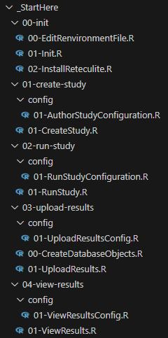

Executing Study Steps
=================

This guide gives a quick start guide to executing all of the steps of a study. 
These steps include the following:
<ul>
	<li>
		Initializing the R Environment
	</li>
	<li>
		Createing the Study Definition
	</li>
	<li>
		Running the Study
	</li>
	<li>
		Uploading the Results
	</li>
	<li>
		Viewing the Study Results
	</li>
</ul>

Everything needed to complete all of these steps can be found in the _StartHere folder. 
The structure of the _StartHere folder is shown below.  
 

  

The initialization scripts are a special case.  These scripts are run once to configure and initialize your R environment. Each of these scripts must be run before executing any of the other steps. 

Each of the other steps is defined in two files, a configuration file and an implementation file that is used to exeute the step. For example, the files used to create a study are found in 01-create-study. This folder contains a configuration file (01-create-study/config/01-AuthorStudyConfiguration.R) and an implementation file (01-create-study/01-CreateStudy.R). In most cases the configuration file is the only file that will need to be edited to implement your study. 

It should be noted that in many cases a user will run one or a subset of the steps below. For example, data providers will not run the Create Study step. Note that in all cases the initialization step must be executed before running any other step. 

## Initialization: Run the Setup Scripts
<b>Note: this step must be run before any of the other steps shown below. This step only needs to be run once. </b>
 

<b>Important: Open R as Admin.</b> The following process will require the installation of many R packages.  Some of these installs will fail if you do not run as Admin.  
Start RStudio as Admin. Select File->Open Project and navigate to the StrategusStudyRepoTemplate.proj file in the StrategusStudyRepoTemplate project. 

Run the scripts in the \_StartHere/init folder in order:
<ul>
	<li>
		<b>00-EditRenvironmentFile.R:</b> This script will let you edit your Renviron file.  
		For this step, you will need a Github Personal Access Token (PAT). 
		Use <a href="https://github.com/settings/tokens">https://github.com/settings/tokens</a> to generate your token (you will need to be logged into Github first for this to work). 
		Add the following lines to the .Renviron file (where MY_GITHUB_PAT) is the token you've just generated:  
		 
		_JAVA_OPTIONS='-Xmx4g' 
    VROOM_THREADS=1 
		DATABASECONNECTOR_JAR_FOLDER = "C:\Program Files\Stragegus\jdbc\drivers" 
		GITHUB_PAT='MY_GITHUB_PAT' 
		 
		After editing and saving this file, restart R (Session->Restart R). 
		You can close the .REnviron file once this step has been completed.   
		<b>Important: Don't forget to save the file before restarting R.</b> 
		<b>Important: Don't forget to restart R.</b> 
	</li>
	<li>
		<b>01-Init.R:</b> This script will run renv::restore(). The renv::restore() call sets your R environment to a spcific configuration that uses a specific set of pacakges and versions of each of those packages.  It is a tool used to create somewhat of a frozen code release of the software we are creating and using here.  
	</li>
	<li>
		<b>02-install-reteculite.R:</b> This script installs the Python environment that will be used by R. 
	</li>
</ul>
