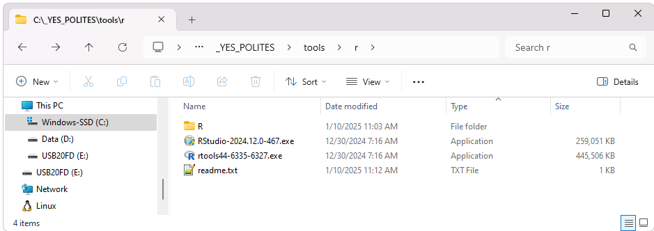
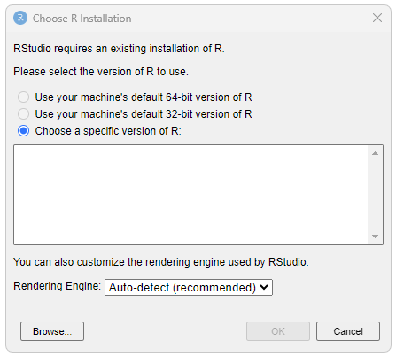
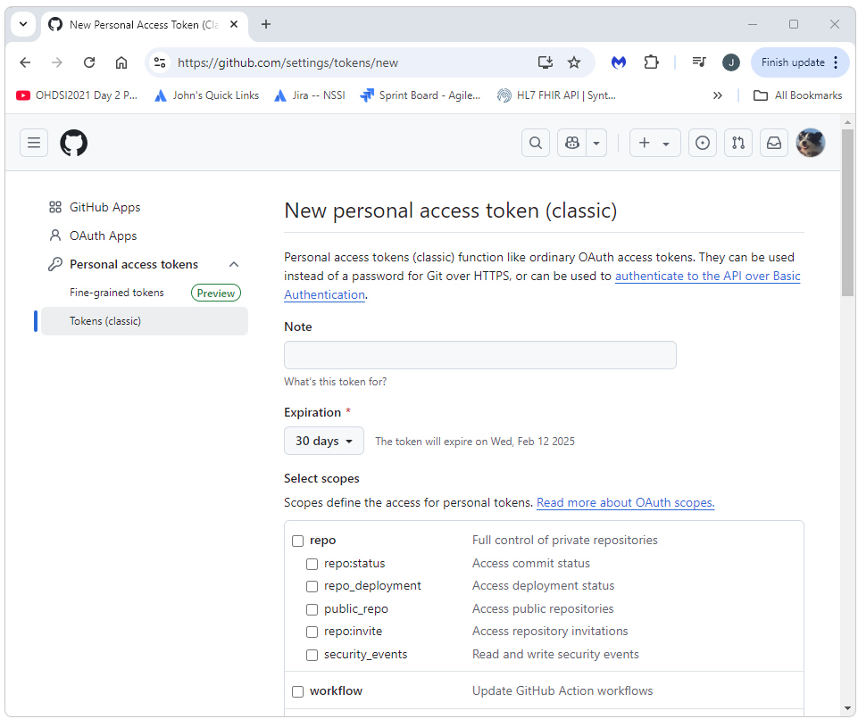

Setup Environment Using Polites
=================

This guide will walk through how to setup your Windows environment using Polites. 
More information on using the Polites tools to setup your environment can be found at https://greshje.github.io/polites/quick-start.html. 

## Download and Install PostgreSql and pgAdmin
PostgreSql is reqired for storing the data generated by Strategus.  Download and install PostgresSql and pgAdmin from https://www.enterprisedb.com/downloads/postgres-postgresql-downloads (both applications are bundled in a single download in the downloads provided on this page).  This documentation was tested using the Windows x86-64 version 17.2 installer. 

## Download the Polites YesInstaller
Download and run the YesPolitesInstaller executable file. 
Click <a href="https://www.dropbox.com/scl/fi/534uvoc8y2iuz91tcx0ah/YesPolitesInstaller-1.2.061.exe?rlkey=nseujjakkumfm4oesp3j8d3lz&dl=1">here</a> to download. 

Navigate to C:\_YES_POLITES\tools\r and run the RTools installer and the RStudio installer (R has already been installed by the YesPolites installer).  

 
## Configure RStudio
Open RStudio.  When prompted to choose an R installation, use the browse option and then use:  
C:\\_YES_POLITES\\tools\\r\\R\\R-4.4.1\\bin\\R.exe  
If not propted, select tools->Global Options->General->R version 

## Fork and Clone the StrategusStudyRepoTemplate project
Fork the StrategusStudyRepoTemplate and create a new branch in your forked version. 
Clone your forked version and checkout the branch you created. 

## Generate your Github Personal Access Token (PAT)
In order to install the R packages required for this project, you will need a Github Personal Access Token (PAT).   
A token can be created at the following Github URL (I'm not sure what privileges are required, for now, I simply select them all): 
https://github.com/settings/tokens 

## Open RStudio as Admin and then Open the StrategusStudyRepoTemplate Project
Important: Open R as Admin. The following process will require the installation of many R packages.  Some of these installs will fail if you do not run as Admin.   
Start RStudio as Admin. Select File->Open Project and navigate to the StrategusStudyRepoTemplate.proj file in the StrategusStudyRepoTemplate project you just cloned and checked out.  

## Run the Setup Scripts
Run the scripts in the \_StartHere/init folder in order:
<ul>
	<li>
		<b>00-EditRenvironmentFile.R:</b> This script will let you edit your Renviron file.  
		For this step, you will need a Github Personal Access Token (PAT). 
		Use <a href="https://github.com/settings/tokens">https://github.com/settings/tokens</a> to generate your token (you will need to be logged into Github first for this to work). 
		Add the following lines to the .Renviron file (where MY_GITHUB_PAT) is the token you've just generated:  
		 
		_JAVA_OPTIONS='-Xmx4g' 
    VROOM_THREADS=1 
		DATABASECONNECTOR_JAR_FOLDER = "C:\Program Files\Stragegus\jdbc\drivers" 
		GITHUB_PAT='MY_GITHUB_PAT' 
		 
		After editing and saving this file, restart R (Session->Restart R). 
		You can close the .REnviron file once this step has been completed.   
		<b>Important: Don't forget to save the file before restarting R.</b> 
		<b>Important: Don't forget to restart R.</b> 
	</li>
	<li>
		<b>01-Init.R:</b> This script will run renv::restore(). The renv::restore() call sets your R environment to a spcific configuration that uses a specific set of pacakges and versions of each of those packages.  It is a tool used to create somewhat of a frozen code release of the software we are creating and using here.  
	</li>
	<li>
		<b>02-install-reteculite.R:</b> This script installs the Python environment that will be used by R. 
	</li>
</ul>
